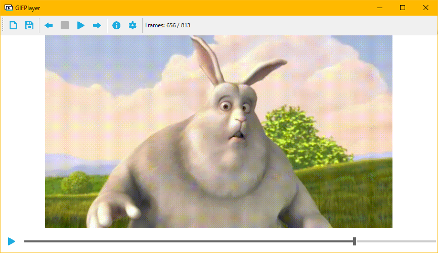
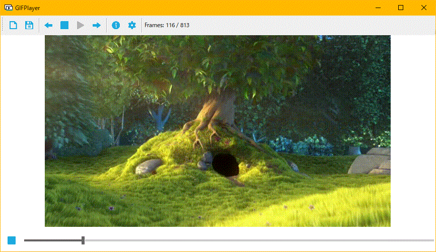

<div align="center"></div>

# GIFPlayer

GIFPlayer is a GIF player that allows for frame-by-frame playback, built-in C#.
It provides intuitive graphical UI to allow users to easily manipulate the animated GIF playback.
Multiple features including autoplay, frame-by-frame adjustment, save a frame as a file, seek bar, real-time frame state, and more.

<div align="center"></div>

## Animated Demo
<div align="center"></div>

## Downloading
### On Windows

The latest release of the GIFPlayer binary is located only in GitHub.
```.NET Framework 4.6.1``` is required to launch the program.

### On other platforms

GIFPlayer is **not currently supported on other platforms**, as the fundamental features mainly rely on the .NET Framework.
However, it is possible to implement with .NET Core, which has compatibility with other platforms like Linux, and Mac.
Pull requests are more than welcome.

## Keybindings

| Key              | Action                                        |
| ---------------- | --------------------------------------------- |
| Ctrl+S           | Save the present frame as a single image file |
| Ctrl+Space       | Play / Pause                                  |
| Ctrl+Right arrow | Next frame                                    |
| Ctrl+Left arrow  | Previous frame                                |

## Future updates
* Speed up the time to load the previous frame
* Drag + Drop feature
* Associate file extension

## Dependencies
* .NET Framework
* MetroFramework